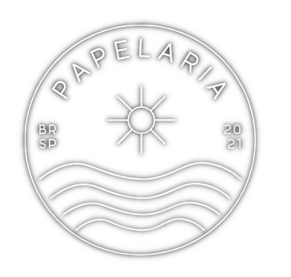

# Angular Store Papelaria

Aplicação desenvolvida no curso [Angular 9](https://www.cod3r.com.br/courses/angular-9-essencial) da [Cod3r](https://www.cod3r.com.br/). Desenvolvido com **JSON Server** como back-end e **Angular** no front-end.
Fiz um vídeo bem curto de como ficou a aplicação. Veja [aqui](https://www.loom.com/share/c60d2c03baa541ffafa00e823e0999ba).

[`Descrição`](#Descrição) | [`Funcionalidades`](#Funcionalidades) | [`Execução`](#Execução) | [`Pré-requisitos`](#Pré-requisitos) | [`Autoria`](#Autoria)

# Descrição
Projeto simples para operações simples de CRUD (Create Read Update Delete) para a prática dos fundamentos do **Angular 9**.

# Funcionalidades

 - Criação de novos itens com nome e preço;
 - Alteração do nome e/ou preços de um item pelo seu id;
 - Exclusão de um item pelo seu id;
 - Listagem dos itens;
 - Utilização do Material Design e alguns elementos das diretivas da linguagem.

# Pré-requisitos
Para rodar essa aplicação é necessário instalar o Angular CLI:

    npm install -g @angular/cli

Para confirmar a instalação

    ng -v

# Execução
Clone esse repositório em uma pasta local.

**Back-end**
Pelo terminal, entre na pasta do back-end

     cd backend

Inicie o servidor

    npm start

**Front-end**
Por outra janela do terminal, entre na pasta do projeto

    cd frontend

Inicie o projeto

    ng s

No navegador, acesse o endereço

    http://localhost:4200/

Você deve ser capaz de visualizar a home do projeto.

# Autoria
[Paula Nogueira Guedes](https://www.linkedin.com/in/paulanguedes/) 😉️

*O projeto com base no tutorial [Angular 9](https://www.cod3r.com.br/courses/angular-9-essencial) da [Cod3r](https://www.cod3r.com.br/).*
